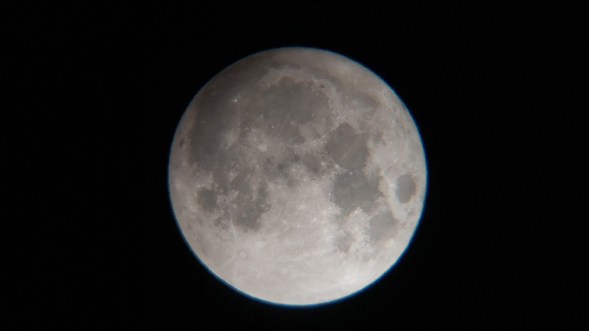

# Observation Date: October 31, 2020

Time of Observation: 16:14 UTC

Location: Antalya, Gazipaşa, Turkey

Telescope: Celestron AstroMaster 130EQ-MD CL 31051, 130mm (5.1-inch) aperture, f/5

Camera: Samsung Galaxy A70, 16 MP (f/1.7, 26mm focal length)

Filters Used: None 

Exposure Time: Approx. 1/500 seconds (auto exposure settings)

Focal Length: 26mm (Smartphone lens)

Resolution: 2268 x 4032 pixels

Lunar Phase: Full Moon, 100% illumination

Selenographic Coordinates: Latitude 0° (Moon’s center), Longitude 0° (Moon’s center)

Field of View: Approx. 12 x 6 degrees (estimated based on smartphone field of view)

Image Scale: Approx. 1.5 arcminutes per pixel (estimated from camera resolution and focal length)

## Lunar Features Observed:

### Craters:

Tycho (52 km diameter): Prominent ray system extending across the southern hemisphere of the Moon. Central peak clearly visible.

Copernicus (93 km diameter): Clearly defined, with terraced walls and a central peak. Ejecta rays visible extending outward.

Aristarchus (40 km diameter): Brightest crater on the Moon, located in the northern part of the visible lunar surface.

Plato (101 km diameter): Flat-floored crater with a dark interior, visible along the northern limb.

### Maria (Lunar Seas):

Mare Imbrium: Large, dark basaltic plain covering a major portion of the Moon's northern hemisphere.

Mare Tranquillitatis: Smooth and dark plains near the eastern limb, with a few scattered craters.

Highlands:

Rugged, highly cratered terrain around the central portion of the Moon’s surface. A wide variation in surface texture visible, especially in the region around the terminator.

Regolith:

Surface texture visible in high resolution around the terminator and illuminated regions, showing scattered lunar dust and small craters.

Shadow Detail:

Sharp contrasts observed along the terminator. Shadows reveal lunar topography, with clearly visible elevation differences such as those around the central peak of Tycho and crater walls like those of Copernicus.

Weather Conditions: Clear skies, good seeing conditions (8/10), no significant atmospheric distortion. No clouds or moisture, allowing for high-quality observation.

### Notes:

The image was taken with a smartphone camera, leading to some slight compression and lower resolution in comparison to specialized astronomical cameras.

The Celestron AstroMaster 130EQ-MD, with its 130mm aperture, provided a bright and clear view of the full Moon, though this image likely doesn’t show the full resolution potential of the telescope due to the limitations of the smartphone camera.

Despite using a smartphone camera with a wide field of view (26mm focal length), the image captures the full lunar disk with noticeable features such as craters, maria, and highlands.

The full Moon's 100% illumination presents an opportunity to observe a wealth of surface detail. The sharp shadows at the terminator zone highlight lunar topography and relief, useful for studying the Moon’s surface in detail.

The absence of filters means the image retains natural color tones, but slight overexposure may occur due to the brightness of the full Moon, which may lead to loss of detail in brighter regions.

### **Other Notes:**

- Weather: Clear skies, excellent seeing (8/10)  
- Shadows highlight lunar topography, especially near terminator.  
- No filters used, natural colors preserved but slight overexposure in bright areas.

---
[🔙 Back to Observation Logs](https://yusufsehauysal.github.io/Astronomy/)

